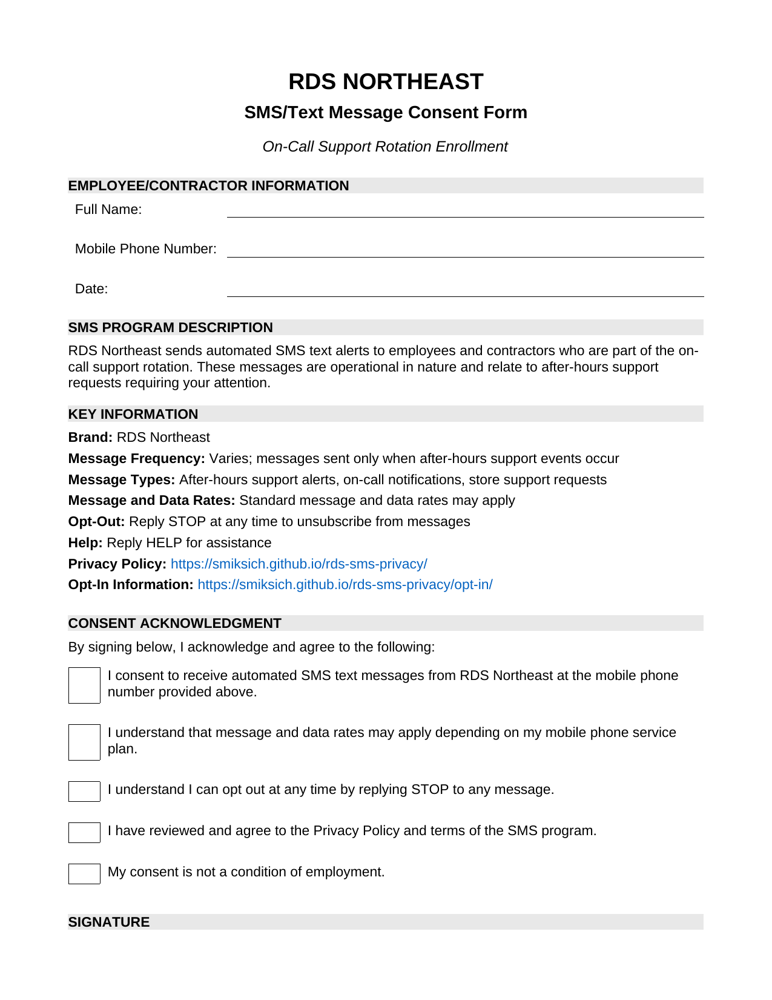

# RDS Northeast SMS Opt-In Information

**Last Updated:** February 2025

## Program Overview

**Brand:** RDS Northeast

**Purpose:** RDS Northeast sends automated SMS text alerts to employees and contractors who are part of the on-call support rotation. These messages are operational in nature and relate to after-hours support requests requiring attention.

**Message Frequency:** Varies; messages are sent only when after-hours support events occur.

**Message and Data Rates:** Standard message and data rates may apply depending on your mobile phone service plan.

---

## How Opt-In Occurs

Employees and contractors opt in to receive SMS messages by voluntarily providing their mobile phone number when they are added to the on-call rotation. Consent is obtained **before** any SMS messages are sent.

---

## Consent Methods

RDS Northeast collects consent through the following methods:

### 1. Verbal Consent

During onboarding or assignment to on-call rotation, the following verbal consent script is read to the employee/contractor:

---

**MANAGER/HR REPRESENTATIVE:**

> "As part of your on-call rotation duties with RDS Northeast, we can send you automated text message alerts when after-hours support events occur that require your attention.
>
> Message frequency varies based on support needs. Standard message and data rates may apply, depending on your mobile phone service plan.
>
> At any time you can get help by replying HELP to any message, or you can opt out completely by replying STOP.
>
> Our Privacy Policy is available at smiksich.github.io/rds-sms-privacy and opt-in information can be found at smiksich.github.io/rds-sms-privacy/opt-in.
>
> Do you consent to receive these text message alerts as part of your on-call responsibilities?"

**EMPLOYEE/CONTRACTOR:**

> "Yes, I consent."

**MANAGER/HR REPRESENTATIVE (Confirmation):**

> "Great! You will receive a confirmation text message shortly to verify your enrollment. Remember, you can reply STOP at any time if you wish to unsubscribe."

---

Verbal consent is documented internally with the following information:
- Employee/Contractor Name
- Mobile Phone Number Provided
- Date and Time of Consent
- Name of Manager/HR Representative
- Confirmation that all disclosures were read
- Employee's affirmative response

### 2. Written Consent

Employees/contractors may also provide consent via internal written consent forms. The form includes:

- Employee name and mobile phone number
- Brand identification (RDS Northeast)
- Program description
- Message frequency disclosure
- Message and data rates disclosure
- Opt-out instructions (Reply STOP)
- Help instructions (Reply HELP)
- Privacy Policy link
- Checkbox acknowledgments
- Signature and date

**View the Written Consent Form:**

[Download Consent Form (PDF)](RDS_Northeast_SMS_Consent_Form.pdf)

### 3. Digital Consent

Consent may also be collected through internal company systems where phone numbers are voluntarily submitted as part of on-call rotation assignment.

---

## Required Disclosures

All consent methods include the following required disclosures to recipients:

| Disclosure | Information |
|------------|-------------|
| **Brand Identification** | RDS Northeast |
| **Message Frequency** | Varies; messages sent only when after-hours support events occur |
| **Message and Data Rates** | Standard message and data rates may apply |
| **Privacy Policy** | [https://smiksich.github.io/rds-sms-privacy/](https://smiksich.github.io/rds-sms-privacy/) |
| **Opt-In Information** | [https://smiksich.github.io/rds-sms-privacy/opt-in/](https://smiksich.github.io/rds-sms-privacy/opt-in/) |
| **Opt-Out Instructions** | Reply STOP at any time to unsubscribe |
| **Help Instructions** | Reply HELP for assistance |

---

## Sample Messages

The following are examples of messages that may be sent:

**Message Sample #1:**
> RDS On-Call Alert: Store S[Store] has requested after-hours support. Please respond ASAP. Reply STOP to opt out.

**Message Sample #2:**
> RDS On-Call Alert: After-hours customer call received for Store S[Store]. Check email for details. Reply STOP to opt out.

**Message Sample #3:**
> RDS On-Call Alert: After-hours support request received for Store S[Store]. On-call technician has been notified. Reply STOP to opt out.

---

## Opt-Out Process

Recipients may opt out of SMS messages at any time by replying **STOP** to any message.

Upon opt-out:
- A confirmation message will be sent
- No further messages will be sent from this campaign
- The opt-out is processed immediately

To re-subscribe, contact RDS Northeast directly.

---

## Help Process

Recipients may reply **HELP** at any time to receive information about the service and opt-out instructions.

---

## Compliance

- This is **not** a marketing campaign
- Messages are sent only to employees/contractors in the on-call rotation
- Consent is obtained before sending any messages
- All required disclosures are provided at the time of opt-in
- "Message and data rates may apply" disclosure is included

---

## Contact

For questions about this SMS program:

**RDS Northeast**  
Email: support@rdsnortheast.com

---

## Privacy Policy

View our full SMS Privacy Policy at: [https://smiksich.github.io/rds-sms-privacy/](https://smiksich.github.io/rds-sms-privacy/)
